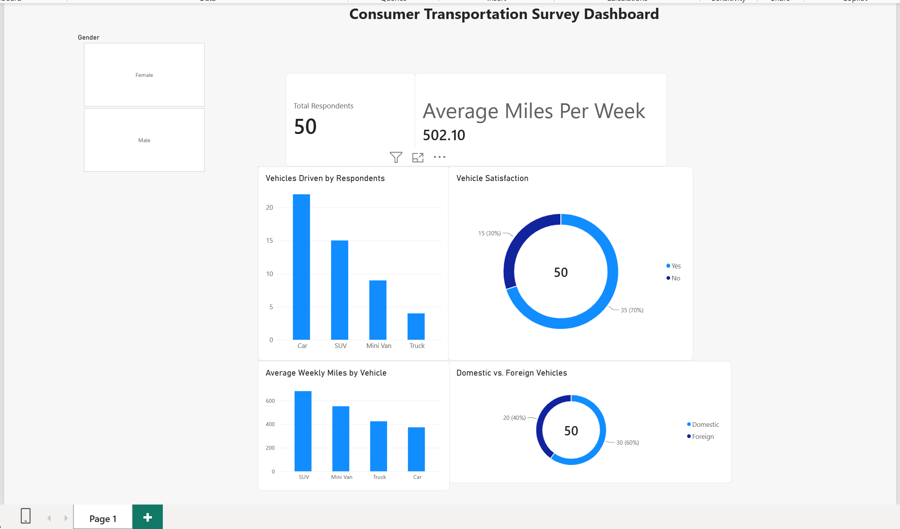

# Consumer Transportation Survey Dashboard

## Project Overview
This Power BI dashboard analyzes consumer transportation survey data to explore vehicle preferences, driving habits, and vehicle satisfaction.

## Dashboard Preview

## Key Insights
- Analyzed survey data from 50 respondents
- Compared the number of respondents driving different vehicle types
- Examined average weekly miles driven by vehicle type
- Compared domestic and foreign vehicles
- Analyzed overall vehicle satisfaction
- Used an interactive gender slicer to compare results

## Dashboard Features
- Total Respondents KPI
- Average Miles Per Week KPI
- Vehicles Driven by Respondents
- Vehicle Satisfaction
- Average Weekly Miles by Vehicle
- Domestic vs. Foreign Vehicles
- Interactive Gender Slicer

## Tools Used
- Power BI
- Microsoft Excel
- Data Analysis
- Data Visualization

## Project File
Download `Consumer_Transportation_Dashboard.pbix` to explore the interactive dashboard in Power BI Desktop.
